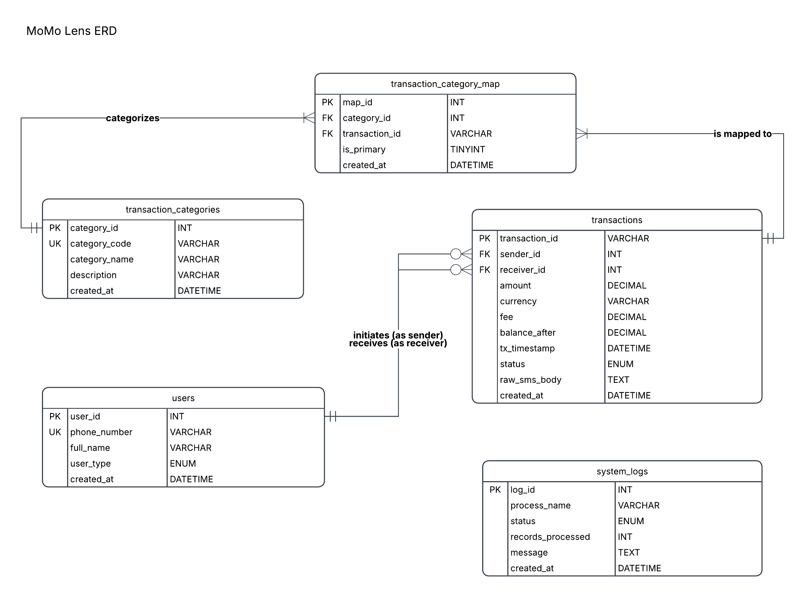

# MoMo Lens

**Team:** Web Artisans  
**Course:** Enterprise Web Development

## Project Description

MoMo Lens is a full-stack application that processes Mobile Money (MoMo) SMS transaction data provided in XML format (`modified_sms_v2.xml`). It cleans and categorizes raw transaction records, stores them in a normalized relational MySQL database (Third Normal Form), serializes structured payloads via JSON, and exposes analytics through an interactive dashboard for financial trend tracking.

**Pipeline:** XML SMS export &rarr; parse &rarr; clean/normalize &rarr; categorize &rarr; load into relational database &rarr; JSON API serialization &rarr; visualize on dashboard.

## Team Members

| Name | GitHub | Role |
|---|---|---|
| Ishimwe Rwigamba Kenny Louange | [@kennyrwigamba](https://github.com/kennyrwigamba) | Database Architecture & SQL Implementation |
| Maunice Akaliza | [@Akaliza-ux](https://github.com/Akaliza-ux) | ERD Design & JSON Modeling |

## System Architecture

High-level architecture diagram:  
[@Link to the architecture diagram](https://app.diagrams.net/#G1VeovJ0P1I-WPy2vZ1r9kVdFE0xaAaCHP#%7B%22pageId%22%3A%22-w0HEG6bdLZIW8pZsZ7u%22%7D)


## Scrum Board

Task board (To Do / In Progress / Done): [MomoLens Project Board](https://github.com/users/kennyrwigamba/projects/2/views/2)

## Assigment 2 Deliverables: Database Foundation & JSON Modeling

### Entity Relationship Diagram (ERD)

The database schema is structured in 5 core tables, featuring a Many-to-Many junction table (`transaction_category_map`) and decoupled system audit logs table:



### Key Deliverables

| Deliverable | File Path | Description |
|---|---|---|
| **Database Design Document (PDF)** | [`docs/MoMo_Lens_Database_Design_Document.pdf`](docs/MoMo_Lens_Database_Design_Document.pdf) | Master PDF report with visual ERD, data dictionary, normalization rationale, and verified query results |
| **Visual ERD Diagram** | [`docs/MoMo-Lens-ERD.png`](docs/MoMo-Lens-ERD.png) | High-resolution visual ERD diagram showing 5 normalized tables and cardinalities |
| **SQL Schema Setup** | [`database/database_setup.sql`](database/database_setup.sql) | DDL script initializing database, tables, CHECK constraints, foreign keys, indexes, and seed data |
| **CRUD Operations** | [`database/crud_operations.sql`](database/crud_operations.sql) | Test suite covering CREATE, READ (with joins and many-to-many aggregations), UPDATE, and DELETE |
| **JSON Schemas** | [`examples/json_schemas.json`](examples/json_schemas.json) | JSON Schema (Draft-07) specifications for User, Category, Transaction, and SystemLog |
| **Complex JSON** | [`examples/complex_transaction.json`](examples/complex_transaction.json) | Complete nested transaction response representing a REST API payload |
| **SQL-to-JSON Mapping** | [`docs/sql_to_json_mapping.md`](docs/sql_to_json_mapping.md) | Technical guide explaining relational column to JSON field serialization rules |
| **AI Usage Log** | [`docs/ai_usage_log.md`](docs/ai_usage_log.md) | Transparent log of AI assistance and compliance statement |

## Database Setup & Execution

### 1. Database Setup
Execute the setup script in MySQL:

```sql
SOURCE database/database_setup.sql;
```

This creates the database `momo_lens_db`, all 5 normalized tables (`users`, `transaction_categories`, `transactions`, `transaction_category_map`, `system_logs`), sets up `CHECK` constraints and indexes, and inserts sample records.

### 2. Verify CRUD & Analytical Queries
Run the verification queries:

```sql
SOURCE database/crud_operations.sql;
```
